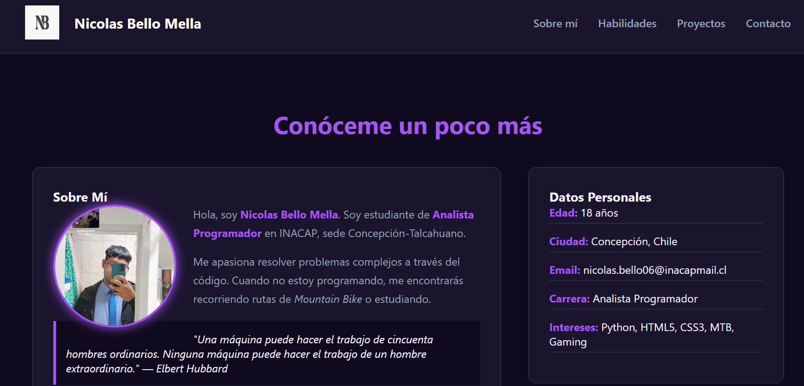
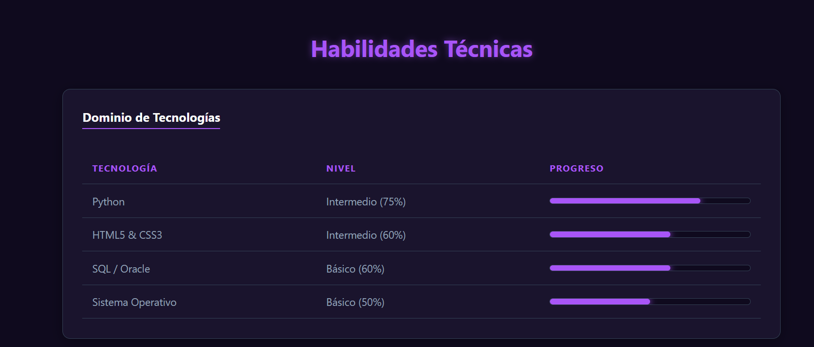
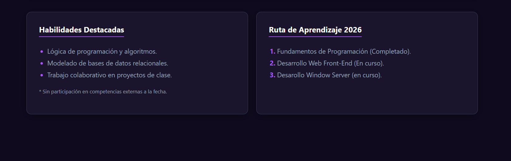
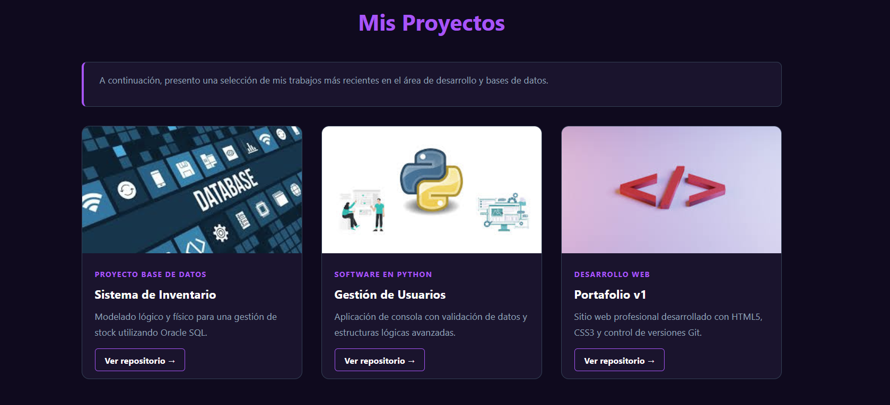
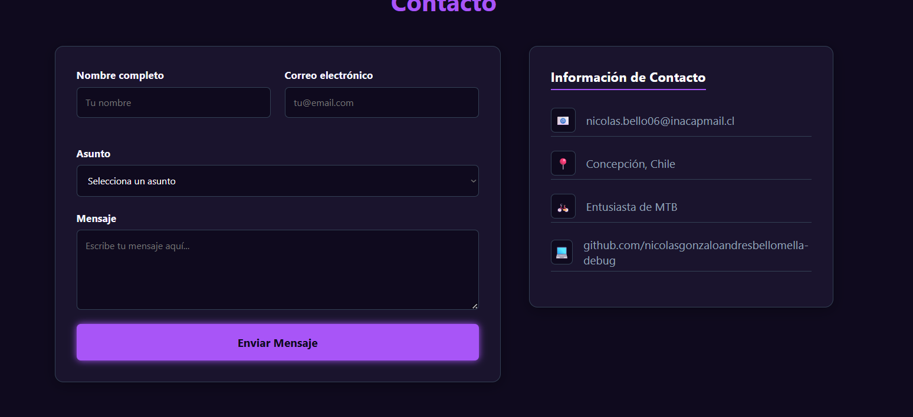
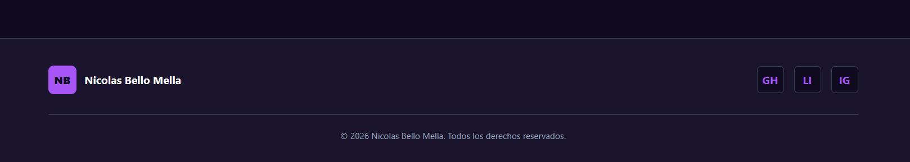

# Portafolio Personal - Evaluación Práctica Front-End

Este repositorio contiene mi portafolio profesional desarrollado como parte de la evaluación práctica del módulo de Desarrollo Web Front-End. 

El diseño utiliza una estética "Cyber Tech" (modo oscuro con acentos de neón) para reflejar un enfoque moderno en la programación y resolución de problemas.

## 🚀 Tecnologías Utilizadas
- **HTML5:** Estructura completamente semántica (`<header>`, `<nav>`, `<main>`, `<section>`, `<article>`, `<aside>`, `<footer>`).
- **CSS3:** Estilos avanzados, variables personalizadas.
- **Layouts:** Implementación de **Flexbox** y **CSS Grid** para la alineación y distribución del contenido.
- **Responsive Design:** Media queries implementadas para visualización óptima en tablets (768px) y smartphones (480px).
- **Git & GitHub:** Control de versiones con historial de commits progresivo.

## 📁 Secciones del Portafolio
1. **Inicio:** Barra de navegación fija (sticky).
2. **Sobre mí:** Biografía y datos personales.
3. **Habilidades:** Tabla técnica con barras de progreso y listas de competencias.
4. **Proyectos:** Galería interactiva desarrollada con CSS Grid.
5. **Contacto:** Formulario validado e información de contacto lateral.

## 🛠️ Instalación y Ejecución

## 🛠️ ¿Cómo ejecutar este proyecto en tu computadora?

Este proyecto no requiere bases de datos, servidores complejos ni la instalación de programas especiales. Todo funciona directamente en tu navegador web. Sigue estos sencillos pasos:

### Opción 1: La forma más rápida (Para cualquier persona)
1. Ve a la parte superior de esta página en GitHub y haz clic en el botón verde que dice **`<> Code`**.
2. Selecciona **`Download ZIP`**.
3. Descomprime (extrae) el archivo `.zip` que se descargó en tu computadora.
4. Entra a la carpeta descomprimida y busca el archivo llamado **`index.html`**.
5. Haz doble clic sobre `index.html` y se abrirá automáticamente en tu navegador web (como Chrome, Firefox o Edge). ¡Y listo, ya puedes ver la página!

### Opción 2: Para desarrolladores o estudiantes (Usando Git)
Si ya tienes Git instalado en tu equipo y quieres clonar el repositorio, abre tu terminal y ejecuta:

``bash
# 1. Clona este repositorio en tu equipo
git clone https://github.com/nicolasgonzaloandresbellomella-debug/prueba-1.git

# 2. Entra a la carpeta del proyecto
cd certamen-1

Luego, simplemente abre el archivo index.html en tu navegador.

## 📸 Capturas de Pantalla

A continuación, se presenta el diseño final del portafolio, destacando la estética "Cyber Tech" y la distribución del contenido a lo largo de la página:

### 1. Inicio y Sobre Mí

*Barra de navegación fija y presentación personal.*

### 2. Dominio de Tecnologías

*Tabla estilizada con indicadores de progreso visuales.*

### 3. Competencias y Ruta de Aprendizaje

*Uso de listas y tarjetas para organizar la información técnica.*

### 4. Galería de Proyectos

*Distribución de los trabajos realizados utilizando CSS Grid.*

### 5. Formulario de Contacto

*Formulario con validación e información de contacto lateral.*

### 6. Pie de Página

*Footer final con enlaces a redes sociales y derechos de autor.*

## 👨‍💻 Autor
**Nicolas Bello Mella**
Estudiante de Analista Programador | INACAP Sede Concepción-Talcahuano.
